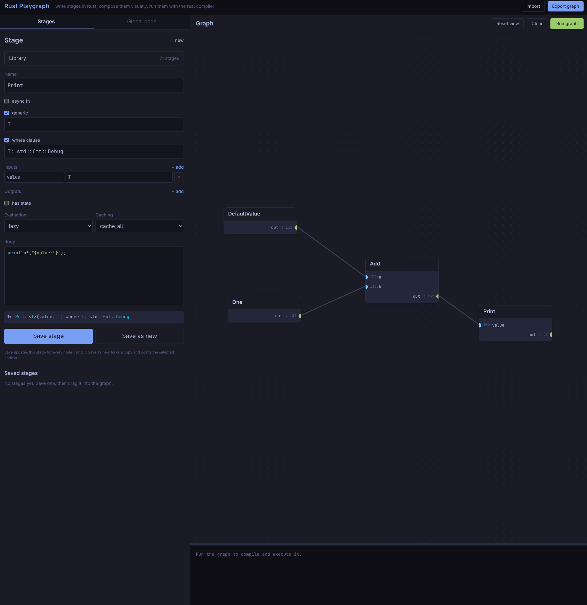

# rust-playgraph

A visual playground for the [`directed`](https://github.com/Eolu/directed) graph engine. Write each
node as a plain Rust function, compose them on a canvas, and run the graph with
the real Rust compiler.

  

This largely exists as a demo project to show what `directed` can do. But if I discover a more
prudent use of it I might be willing to expand it down one path or another.  

## Stage model

A stage is assembled from structured fields in the UI; the parts are combined
into a real Rust function during codegen (the body is left untouched).

| Field | UI | Emitted |
| --- | --- | --- |
| name | text | `fn Name` |
| generic | checkbox, then a param list, e.g. `T` or `T, U` | `fn Name<T, U>` |
| where clause | checkbox, then predicates, e.g. `T: Clone` | `fn Name<T>() where T: Clone` |
| async | checkbox | `async fn` |
| inputs | rows of `name` + `Type`, `+` to add | function parameters |
| outputs | rows of `name` + `Type`, `+` to add | `#[stage(out(...))]` + tuple return |
| body | textarea (inner statements only) | function body |
| state | checkbox, then a type box | `#[stage(state(T))]` |
| eval / cache | selects | `#[stage(lazy, cache_last, ...)]` |

- Inputs become parameters; each output row becomes a named port.
- With no outputs the stage has a single `out: ()`; with one output the function
  returns that value; with several it returns a tuple in the declared order.
- Owned and `&mut` inputs must be `Clone` (the engine shares values by `Arc`).
- Generics are entered without angle brackets (`T`, `T, U`); the UI wraps them.
  Generic stages are fully supported end-to-end: each **node** gets
  type-argument boxes (one per parameter) in its card, and the chosen types are
  substituted into the node's ports and emitted as a turbofish
  (`Identity<i32>`). Leaving a box empty emits `_` and lets the compiler infer it
  from the connections. An optional `where` clause is passed through verbatim.
  (The `directed` macro supports type parameters; lifetime and const parameters
  are rejected.)

Stages (and the whole graph) can be exported to JSON and imported again from the
stage panel.

## Library and persistence

A categorized library of built-in stages ships with the frontend
(`crates/frontend/assets/library.json`, embedded at compile time) and lives in a
collapsible **Library** panel — separate from your own stages, so it never
clutters your list. Drag an entry onto the canvas to create a node (or press
`edit` to load it into the editor as a starting point). Categories include
*Debug & inspect* (`Dbg`, `Print`, `Discard`, …), *Generic tools*, *Numbers*,
*Text*, *Collections*, and *Logic*; most of the generic entries (`Dbg<T>`,
`Discard<T>`, `IfElse<T>`, …) work with any type, and the numeric stages are
generic over [`num-traits`](https://crates.io/crates/num-traits) (so they work
with `i32`, `i64`, `f64`, … — the generated crate gains a `num-traits` dependency
only when needed). Connecting a generic node's port to a concrete one **infers
its type arguments** (e.g. `Zero`'s `T` becomes `f64` when wired to an `f64`
input), so generic nodes hook up without manually setting types.

Your own stages and the graph are saved to the browser's `localStorage` on every
change and restored on your next visit. Built-in stages are not stored — nodes
reference them by name and they're resolved when you run or export — so updating
the library still shows through. Use `export`/`import` to move a playground
between machines. (localStorage is used rather than cookies because stage code
bodies exceed the ~4KB cookie limit.)

## Running

Prerequisites: a Rust toolchain with the `wasm32-unknown-unknown` target and
[`trunk`](https://trunkrs.dev) for the frontend.

```sh
# 1. backend (compiles/runs submitted graphs)
cargo run -p playgraph-backend        # http://127.0.0.1:3001

# 2. frontend (run from the repo root or from crates/frontend)
trunk serve --open                    # http://127.0.0.1:8080
```

The root `Trunk.toml` points Trunk at `crates/frontend`, so `trunk serve` works
from either location. The backend does **not** serve the UI — it only exposes
`/api/*`; load the app from the Trunk dev server.

The generated program depends on the published
[`directed`](https://crates.io/crates/directed) crate, so an installed backend
only needs a Rust toolchain (plus crates.io access on the first run). When run
from this repository the sibling `directed` checkout is used automatically, so
local changes are picked up; set `DIRECTED_PATH=/path/to/directed/directed` to
point at a different checkout. Compiled artifacts are cached in
`.playgraph-cache/` during development, or in a per-user cache directory when the
backend is installed.

## Security

The backend runs arbitrary Rust code submitted by the browser. It is intended
for local development only; do not expose it to untrusted users without
sandboxing (the real rust-playground uses seccomp/container isolation).

## Roadmap

- Node-level metadata overrides (per node, not just per stage).
- Inline compile diagnostics mapped back to the editor.
- Share a playground by URL.
